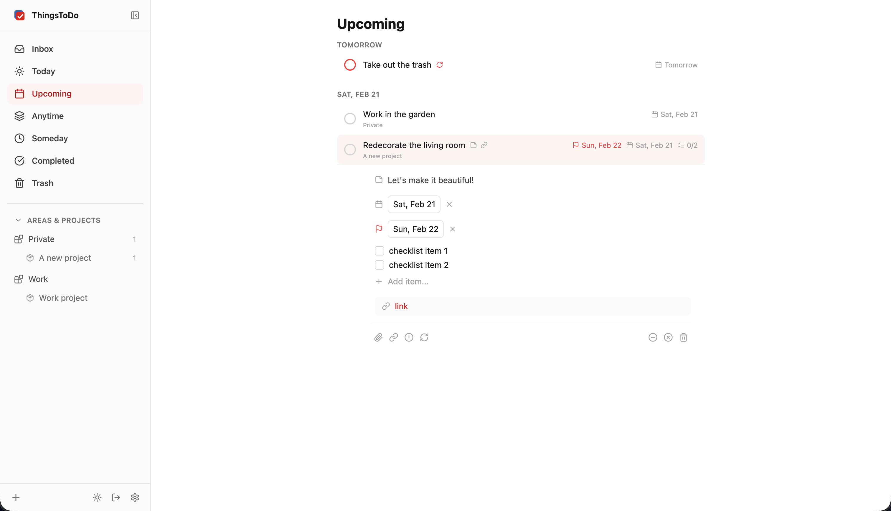

# ThingsToDo

A self-hosted, Things 3 / Todoist inspired task manager.



## Features

- **Offline-First** — all data stored locally in IndexedDB; create, edit, and complete tasks offline with automatic sync when online
- **Projects & Areas** — organize tasks into projects (completable) and areas (ongoing)
- **Tags** — flexible labeling with inline `#tag` syntax and customizable colors
- **Review Tasks** — tasks not edited for a configurable number of days surface in a Review section in Inbox, so nothing falls through the cracks
- **Checklists** — subtasks within any task
- **File Attachments & Links** — attach files or URLs to tasks
- **Multi-Date Scheduling** — schedule tasks across multiple dates with optional start/end times (up to 12 entries per task)
- **Repeating Tasks** — daily, weekly, monthly, and custom schedules
- **Natural Language Dates** — type "tomorrow", "next friday", etc.
- **Keyboard-Driven** — full keyboard navigation and shortcuts
- **Filters** — filter any view by area, project, tag, priority, date, and deadline with saved filter presets
- **Search** — full-text search across tasks and notes
- **Privacy Mode** — blur task titles, notes, and project/area/tag names to prevent over-the-shoulder reading
- **Dark Mode** — automatic or manual theme switching
- **Reminders** — per-task reminders with relative (e.g. 15 min before) and exact time options, plus configurable defaults
- **Push Notifications** — reminders via Browser Push (VAPID) or [ntfy](https://ntfy.sh), configurable in Settings
- **PWA** — installable on mobile and desktop with offline support
- **Single Binary** — Go backend with embedded SPA frontend, SQLite database
- **Sync** — bidirectional push/pull sync with last-write-wins conflict resolution; works across multiple devices

### Offline Limitations

Most features work fully offline. The following require an internet connection:

- **Recurring task rules** — creating, editing, or deleting repeat rules (the recurrence engine runs server-side)
- **File uploads** — uploading new file attachments (requires server-side multipart processing)
- **Search** — full-text search uses server-side FTS5; offline search falls back to basic string matching
- **Settings changes** — user settings are not stored locally and will be lost if changed offline
- **Saved filters** — creating or deleting saved filter presets
- **Reminder scheduling** — the reminder scheduler runs server-side; reminders set offline will fire after sync
- **Logbook/Trash pagination** — local views load all entries (no pagination); may be slow with very large histories

## Quick Start

```yaml
# docker-compose.yml
services:
  app:
    image: ghcr.io/c00llin/thingstodo:latest
    container_name: thingstodo
    volumes:
      - ./data:/data
    ports:
      - "2999:2999"
    environment:
      - AUTH_MODE=builtin
      - JWT_SECRET=change-me-to-a-random-string
      - LOGIN_PASSWORD=your-password-here
    restart: unless-stopped
```

```sh
docker compose up -d
```

Open [http://localhost:2999](http://localhost:2999) and log in with the password you set.

## Configuration

| Variable | Default | Description |
|---|---|---|
| `PORT` | `2999` | Server port (must match container port) |
| `LOG_LEVEL` | `info` | Log level |
| `MAX_UPLOAD_SIZE` | `26214400` | Max file upload size in bytes (25 MB) |
| `AUTH_MODE` | `builtin` | Auth mode: `builtin`, `proxy`, or `oidc` |
| `TZ` | `UTC` | Timezone for reminder scheduling (e.g. `Europe/Amsterdam`) |

### Builtin Auth

| Variable | Default | Description |
|---|---|---|
| `JWT_SECRET` | — | Secret for signing JWT tokens (required) |
| `LOGIN_PASSWORD` | — | Seeds an "admin" user on first start |

### Proxy Auth

For use behind an authenticating reverse proxy (Authelia, Authentik, etc.).

| Variable | Default | Description |
|---|---|---|
| `AUTH_PROXY_HEADER` | `Remote-User` | Header containing the authenticated username |

### OIDC Auth

Log in via any OpenID Connect provider (Google, Keycloak, Authelia, etc.). On first login the existing user is automatically linked to your OIDC identity. Only a single user is allowed — other OIDC accounts are rejected.

| Variable | Default | Description |
|---|---|---|
| `JWT_SECRET` | — | Secret for signing JWT tokens (required) |
| `OIDC_ISSUER` | — | OIDC provider URL (e.g. `https://auth.example.com`) |
| `OIDC_CLIENT_ID` | — | OAuth2 client ID |
| `OIDC_CLIENT_SECRET` | — | OAuth2 client secret |
| `OIDC_REDIRECT_URI` | — | Callback URL: `https://your-domain/api/auth/oidc/callback` |

### API Key

Enable external access (e.g. iOS Shortcuts) with a static API key alongside any auth mode.

| Variable | Default | Description |
|---|---|---|
| `API_KEY` | — | Static bearer token for `Authorization: Bearer <key>` |

### Notifications

Push notifications for task reminders can be delivered via **Browser Push** (default) or **[ntfy](https://ntfy.sh)**. Configure the provider in **Settings > Notifications > Delivery**.

> **Important:** Set the `TZ` environment variable (e.g. `TZ=America/Chicago`) so reminders fire at the correct local time. The Docker scratch image defaults to UTC.

#### Browser Push (VAPID)

VAPID keys are auto-generated on first start and stored in the database. You can also set them explicitly:

| Variable | Default | Description |
|---|---|---|
| `VAPID_PRIVATE_KEY` | auto-generated | VAPID private key |
| `VAPID_PUBLIC_KEY` | auto-generated | VAPID public key |
| `VAPID_CONTACT` | — | Contact email for VAPID (e.g. `mailto:you@example.com`) |

#### ntfy

No env vars required — ntfy is configured entirely from the Settings UI:

- **Server URL** — defaults to `https://ntfy.sh` (or your self-hosted instance)
- **Topic** — defaults to `thingstodo`; subscribe to this topic in the ntfy app on your phone/desktop
- **Access Token** — only needed if your ntfy server requires authentication
- **Base URL** — your app's public URL (e.g. `https://tasks.example.com`) for click-through links in notifications

Use the **Send Test** button to verify your setup.

## MCP Server (Claude Code Integration)

ThingsToDo includes an MCP (Model Context Protocol) server that lets you manage tasks directly from Claude Code or any MCP-compatible client. The server exposes 40+ tools covering views, tasks, projects, areas, tags, headings, checklists, attachments, and schedules.

### Setup

1. Set an `API_KEY` in your ThingsToDo environment
2. Build the MCP server:
   ```sh
   cd mcp && npm install && npm run build
   ```
3. Add to your Claude Code MCP config (e.g. `~/.claude/settings.json`):
   ```json
   {
     "mcpServers": {
       "thingstodo": {
         "command": "node",
         "args": ["/path/to/thingstodo/mcp/dist/index.js"],
         "env": {
           "THINGSTODO_URL": "http://localhost:2999",
           "THINGSTODO_API_KEY": "your-api-key"
         }
       }
     }
   }
   ```

### Available Tools

| Domain | Tools | Description |
|---|---|---|
| Views | `get_today`, `get_upcoming`, `get_inbox`, `get_anytime`, `get_someday`, `get_logbook` | Read task views |
| Tasks | `search_tasks`, `get_task`, `create_task`, `update_task`, `complete_task`, `cancel_task`, `wontdo_task`, `reopen_task`, `delete_task`, `purge_task`, `restore_task` | Full task CRUD |
| Bulk | `bulk_action` | Apply actions to multiple tasks |
| Projects | `list_projects`, `get_project`, `create_project`, `update_project`, `delete_project` | Manage projects |
| Areas | `list_areas`, `get_area`, `create_area`, `update_area`, `delete_area` | Manage areas |
| Tags | `list_tags`, `create_tag`, `update_tag`, `delete_tag` | Manage tags |
| Headings | `list_headings`, `create_heading`, `update_heading`, `delete_heading` | Project sub-sections |
| Checklists | `add_checklist_item`, `update_checklist_item`, `delete_checklist_item` | Task sub-items |
| Attachments | `add_link`, `delete_attachment` | Link management |
| Schedules | `add_schedule`, `update_schedule`, `delete_schedule` | Multi-date scheduling |

## Development

```sh
# Clone and configure
cp .env.example .env   # edit JWT_SECRET and LOGIN_PASSWORD

# Run backend (port 2999) + frontend dev server (port 5173)
make dev
```

The Vite dev server on port 5173 proxies API requests to the Go backend and provides hot reload.

## License

AGPL-3.0
